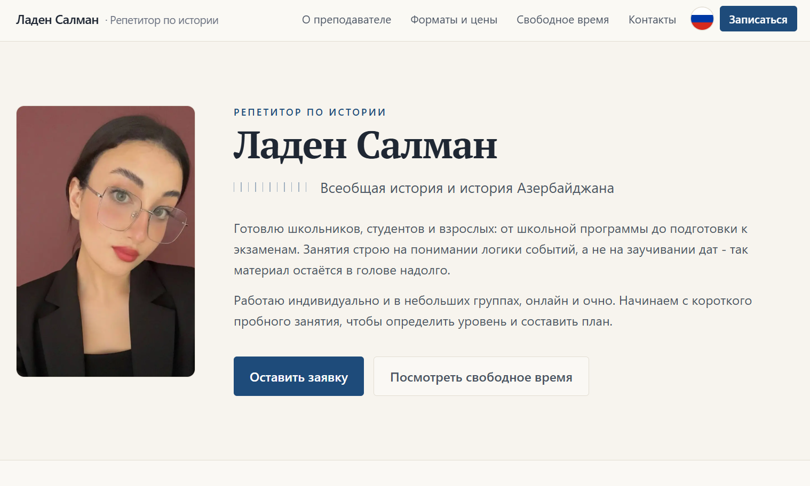
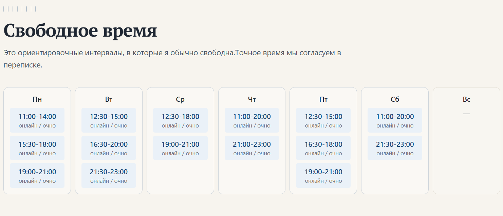
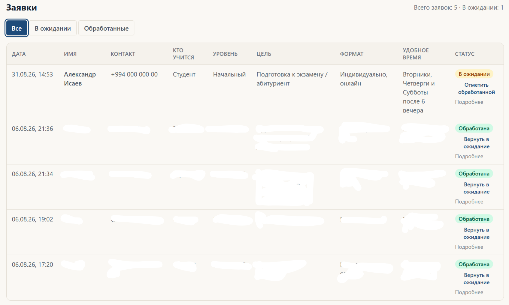

# History Tutor Website

A booking site I built for a real client: a private history tutor in Baku.

Live: [ladensalman.vercel.app](https://ladensalman.vercel.app)

## Screenshots

| Homepage | Availability calendar |
|---|---|
|  |  |

| Admin panel | Telegram notification |
|---|---|
|  |  |

## What it does

- Bilingual site (Russian / Azerbaijani) with a language switcher. Uses a single `[lang]` segment instead of duplicated routes for each language.
- A public "when I'm free" calendar. Not a booking system — just a read-only grid the tutor fills in from her admin panel, so students know what time to ask for.
- A lead form (school grade, current level, goal, individual/group, preferred time) that writes to the database and pings the tutor on Telegram the moment someone submits.
- A password-protected admin panel: see every application, mark it handled, edit the availability grid.

## Stack

- **Next.js 16** (App Router, Turbopack)
- **Supabase** (PostgreSQL) for applications and availability data
- **Telegram Bot API** for instant notifications — just a message straight to the tutor's phone
- **Tailwind CSS**
- **Vercel** for hosting

## How it's built

Two route groups share one Next.js app: `(site)/[lang]` for the public pages and `(admin)/admin` for the tutor's panel, each with its own root layout. The public pages are Server Components that read from Supabase directly and use ISR (`revalidate = 60`) — when the tutor edits her availability, the admin API route calls `revalidatePath` on both language routes so the change shows up immediately instead of waiting for the next revalidation window.

Auth is intentionally minimal: one admin account, so there's no user table and no auth library — just a password checked against an env var and a signed HMAC session cookie, built on the Web Crypto API so the same code runs in Edge middleware and Node route handlers. The password never reaches the client.

The lead form validates on the client for instant feedback, then validates again on the server before touching the database — the client-side check is just UX, the server is the actual gate. On submit: write to Supabase, then fire a Telegram message. If Telegram is down the application is still saved; the student still sees a success screen.

## Setup

```bash
git clone https://github.com/OmarNaghiyev/laden_teacher.git
cd laden_teacher
npm install
cp .env.example .env.local
```

Fill in `.env.local` — every variable it needs is listed there with a comment on what it's for (Supabase project + keys, Telegram bot token, admin password). 

Database schema is in `supabase/schema.sql` — run it once in the Supabase SQL editor before your first `npm run dev`. Then:

```bash
npm run dev
```

Opens at `http://localhost:3000`, redirects to `/ru` or `/az` depending on your browser's language.

## Deploying

Push to GitHub, import into Vercel, add the same env vars from `.env.example` in the Vercel dashboard, deploy.